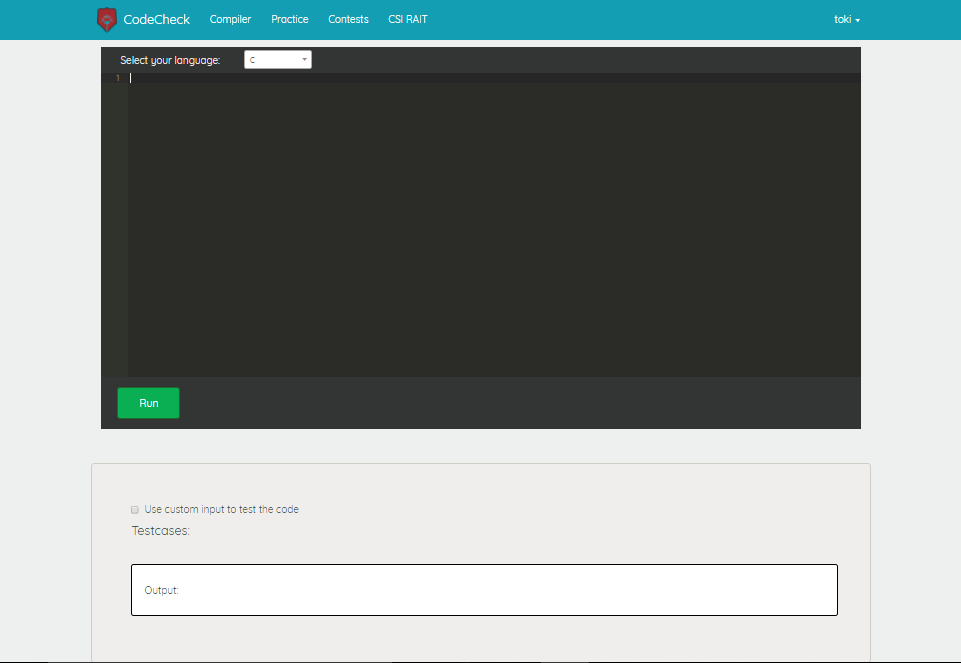
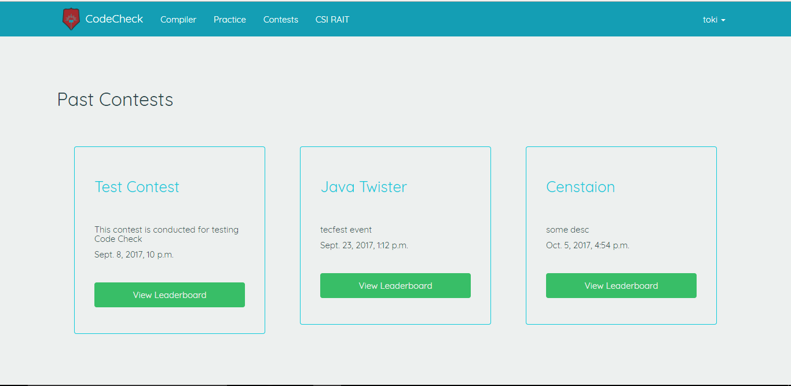
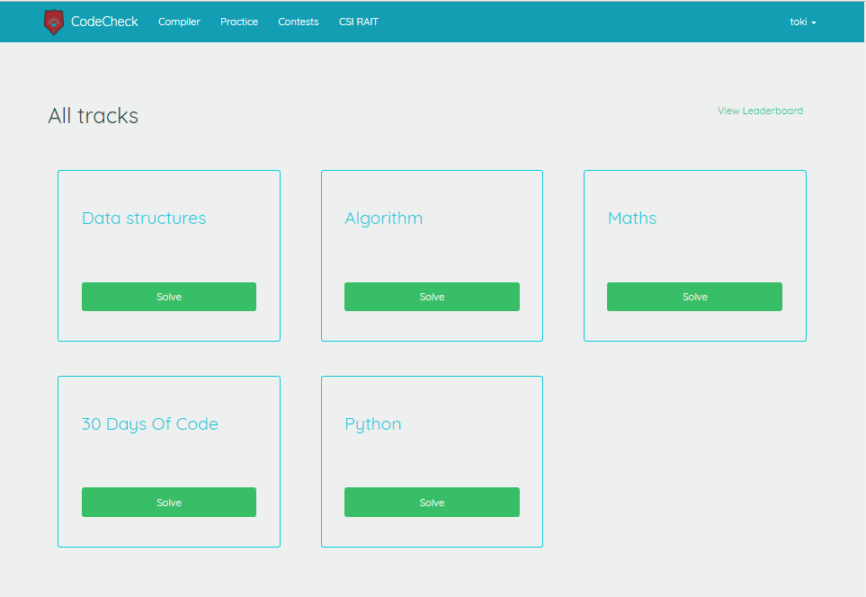
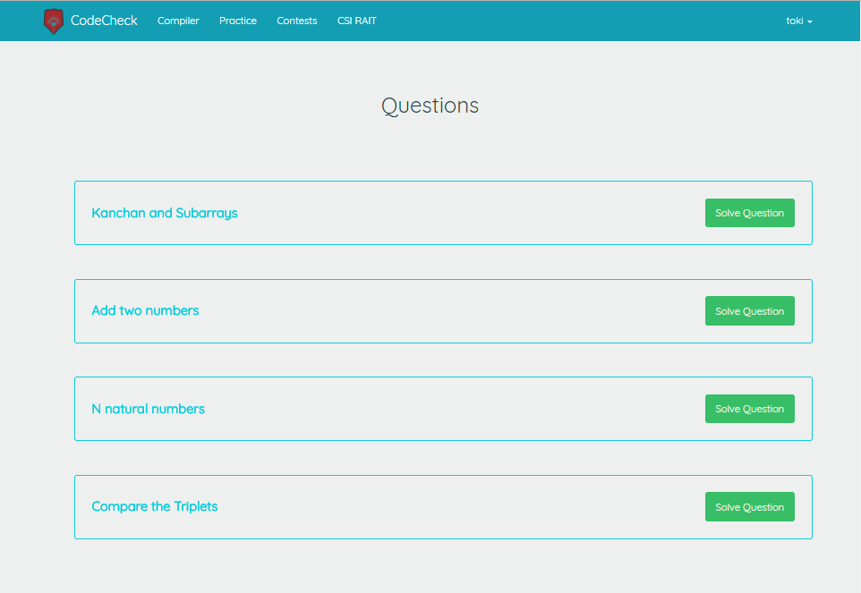
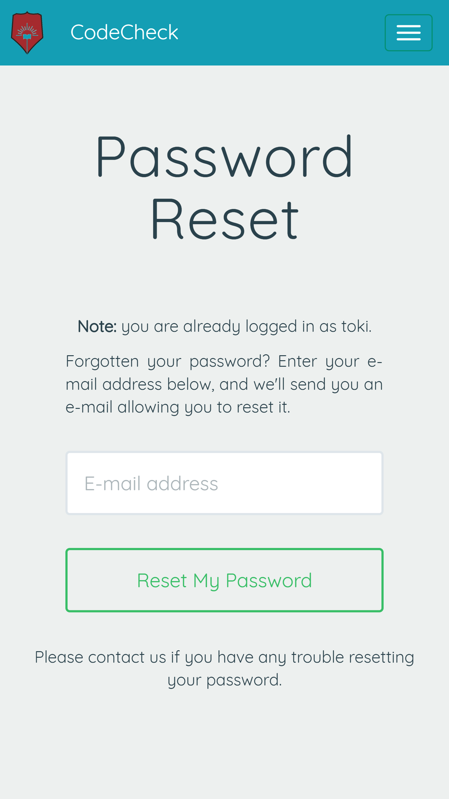

## CodeCheck

CodeCheck is a Django based online judge made using the Hackerrank API.

https://code-check-csi.herokuapp.com/

### Features

- Supports 54 languages
- Contests can be hosted
- Tracks can be added
- Direct compiler is provided to run any code
- Keeps tracks of solved questions of user
- better user stats with leaderboard and charts
- User friendly and fully responsive

### Packages/Platforms used

- [Django](https://www.djangoproject.com/)
- [django-allauth](https://github.com/pennersr/django-allauth)
- [django-crispy-forms](http://django-crispy-forms.readthedocs.io/en/latest/)
- [Heroku](https://www.heroku.com/)
- [Ace Editor](https://ace.c9.io/)

 

